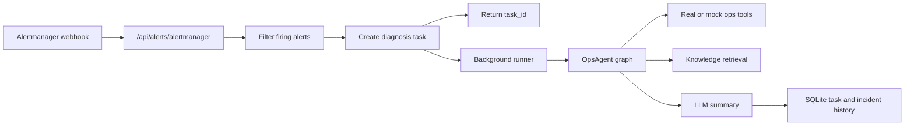

# Alert Webhook

This step adds an alert ingestion layer in front of the existing OpsAgent.

## Endpoints

### POST `/api/alerts/analyze`

Use this endpoint when another service has already normalized the alert.

```json
{
  "alert_id": "alert-payment-5xx",
  "title": "High5xxRate",
  "service": "payment-api",
  "severity": "critical",
  "labels": {
    "team": "payments"
  },
  "annotations": {
    "summary": "payment-api 5xx is above threshold"
  }
}
```

The API converts the alert into an ops question, creates a background diagnosis task,
and returns `202 Accepted` with a `task_id`.

### POST `/api/alerts/alertmanager`

Use this endpoint as a Prometheus Alertmanager webhook receiver.

```json
{
  "version": "4",
  "status": "firing",
  "receiver": "oncall-agent",
  "commonLabels": {
    "alertname": "High5xxRate",
    "service": "payment-api",
    "severity": "critical"
  },
  "commonAnnotations": {
    "summary": "payment-api has elevated 5xx responses"
  },
  "alerts": [
    {
      "status": "firing",
      "startsAt": "2026-07-06T10:00:00Z",
      "fingerprint": "payment-5xx-fingerprint"
    }
  ]
}
```

Only `firing` alerts are queued for diagnosis. `resolved` alerts are counted as ignored.

Repeated `firing` alerts are grouped by a stable dedupe key. For Alertmanager, the
primary key is the alert `fingerprint`. See `docs/alert-dedup.md`.

## Runtime Flow



## Local Check

Run a mock local check without starting the server:

```powershell
.\.venv\Scripts\python.exe scripts\check_alert_webhook.py --in-process --mock-llm
```

The check script submits the webhook payload and then polls `/api/tasks/{task_id}` until
the background diagnosis task finishes.

Run the same alert through real Prometheus, Loki, GitHub, Milvus, and embedding settings:

```powershell
$env:HTTP_PROXY='http://127.0.0.1:7897'
$env:HTTPS_PROXY='http://127.0.0.1:7897'
.\.venv\Scripts\python.exe scripts\check_alert_webhook.py --in-process --mock-llm --real-tools
```

If you are running the FastAPI server manually, use:

```powershell
.\.venv\Scripts\python.exe -m uvicorn app.main:app --reload
.\.venv\Scripts\python.exe scripts\check_alert_webhook.py
```

## Alertmanager Config Example

Native Alertmanager does not calculate an HMAC over each webhook body. Configure
the dedicated `ALERTMANAGER_WEBHOOK_TOKEN` and use its Bearer authorization:

```yaml
receivers:
  - name: oncall-agent
    webhook_configs:
      - url: http://host.docker.internal:8000/api/alerts/alertmanager
        send_resolved: true
        http_config:
          authorization:
            type: Bearer
            credentials_file: /run/secrets/alertmanager_webhook_token
```

HMAC through `WEBHOOK_SECRET` remains available for webhook senders that can
calculate dynamic request signatures. If both methods are configured, either a
valid dedicated Bearer token or a valid HMAC signature is accepted.

For Linux Docker networking, replace `host.docker.internal` with the API host or container
service name used by your deployment.
