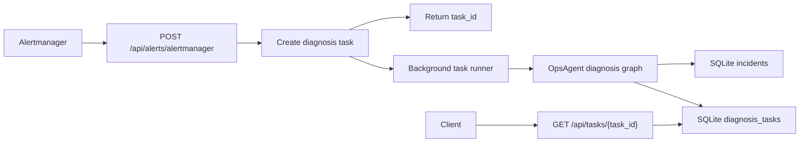

# Async Diagnosis Tasks

This step moves alert-triggered diagnosis from a synchronous HTTP response to a
background task model.

## Why

Real incident diagnosis can take seconds or minutes because it may call:

- LLM APIs
- Embedding and vector search
- Prometheus
- Loki
- GitHub or GitLab

Webhook receivers should respond quickly, so the alert API now creates a task and
returns `202 Accepted` with a `task_id`.

## Flow



## Submit Alert

```powershell
.\.venv\Scripts\python.exe scripts\check_alert_webhook.py --in-process --mock-llm
```

The script:

1. posts a sample Alertmanager payload,
2. reads the returned `task_id`,
3. polls `/api/tasks/{task_id}`,
4. exits successfully when the task status becomes `succeeded`.

## Task Status API

List recent tasks:

```http
GET /api/tasks?limit=20
```

Get one task:

```http
GET /api/tasks/{task_id}
```

Get task progress events:

```http
GET /api/tasks/{task_id}/events
```

Task statuses:

- `queued`: accepted but not started
- `running`: background worker is executing the diagnosis
- `succeeded`: diagnosis completed and result is stored
- `failed`: diagnosis failed and `error` contains the failure message

Progress event types:

- `queued`: task accepted by the API
- `running`: background runner started
- `rerun_requested`: operator requested a new diagnosis task from this task
- `tool_result`: an ops tool finished, such as Prometheus, Loki, GitHub, or topology
- `retrieved_docs`: runbook retrieval finished
- `incident_persisted`: incident and diagnosis records were written
- `succeeded`: task finished successfully
- `failed`: task failed

## Current Implementation

The current queue uses FastAPI background tasks and SQLite. This keeps the project easy
to run locally while preserving the same public API shape needed for a production worker.

The next production upgrade is to move `DiagnosisTaskQueue.run()` into a dedicated worker
backed by Redis, Celery, RQ, Dramatiq, or a cloud queue.
